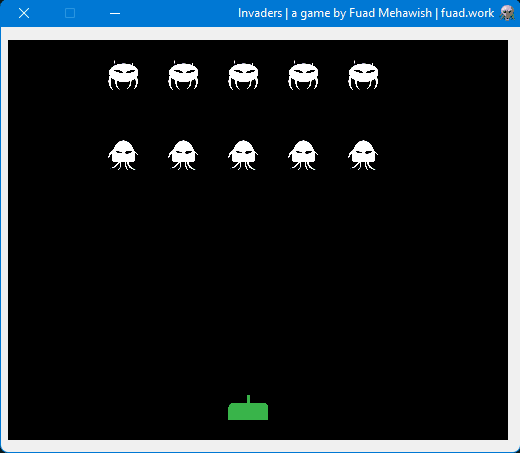

# InvadersGDI
 
Invaders game clone, using GDI and C#

# The project
This was an attempt to see how GDI handles game logics and graphics which turned out not very well  

## GDI
GDI+ is the portion of the Windows operating system that provides two-dimensional vector graphics, imaging, and typography.
